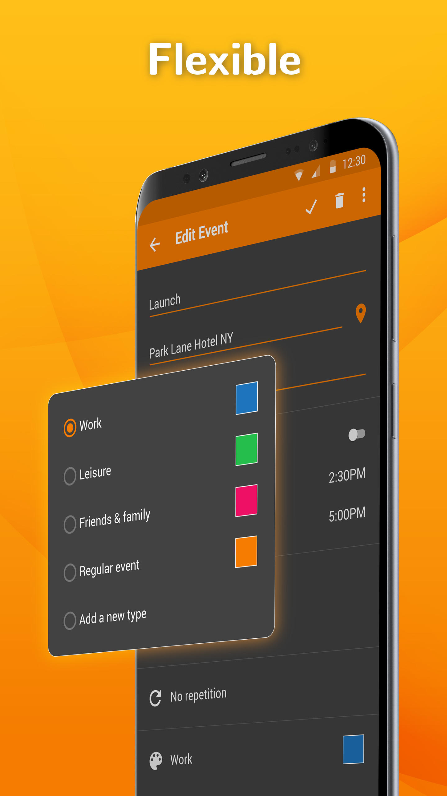

# Simple Calendar

A simple calendar with events and a customizable widget.

A simple calendar with optional CalDAV synchronization. You can easily create recurring events and setup reminders, it can also display week numbers.

Contains a monthly view and an event list widget where you can customize the color of the text, as well as the alpha and the color of the background.

Contains no ads or unnecessary permissions. It is fully opensource, provides customizable colors.

The Storage permission is needed only for exporting or importing events from .ics files.

The Contacts permission is used only at importing contact birthdays and anniversaries.

This app is just one piece of a bigger series of apps. You can find the rest of them at https://www.simplemobiletools.com

## Sponsor

This repo is sponsored by [**Spurwing**](https://www.spurwing.io/), where their API Makes Adding Scheduling Quick, Reliable and Scalable.
Use Spurwing to build and integrate Scheduling, Booking & Calendar features in your project. Read more about Spurwing [**Scheduling API on GitHub**](https://github.com/Spurwing/Appointment-Scheduling-API).
