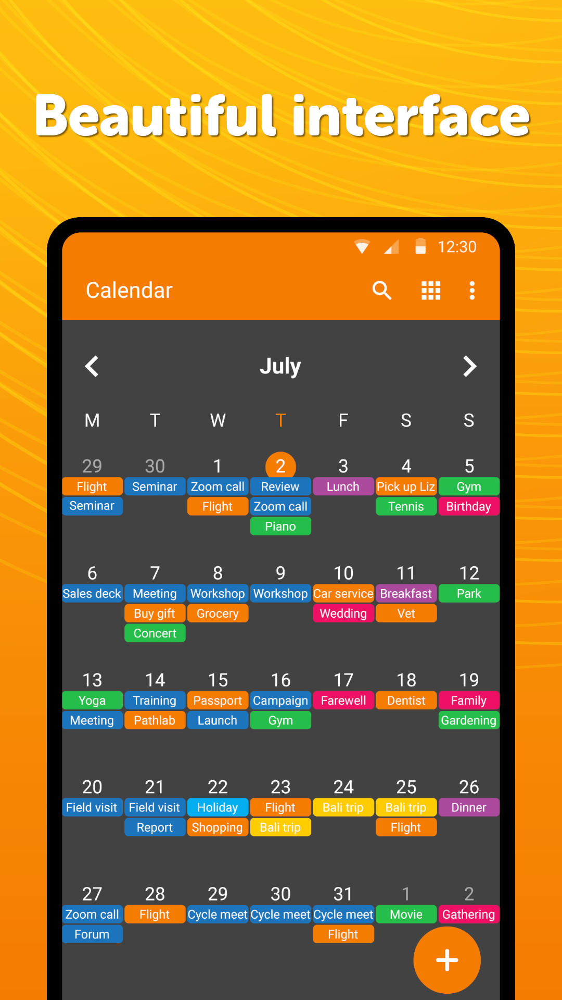
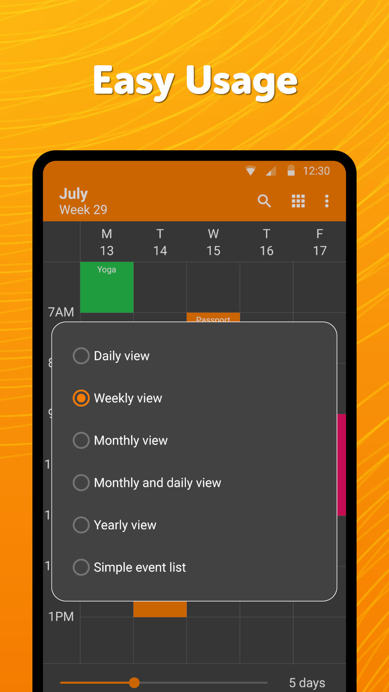
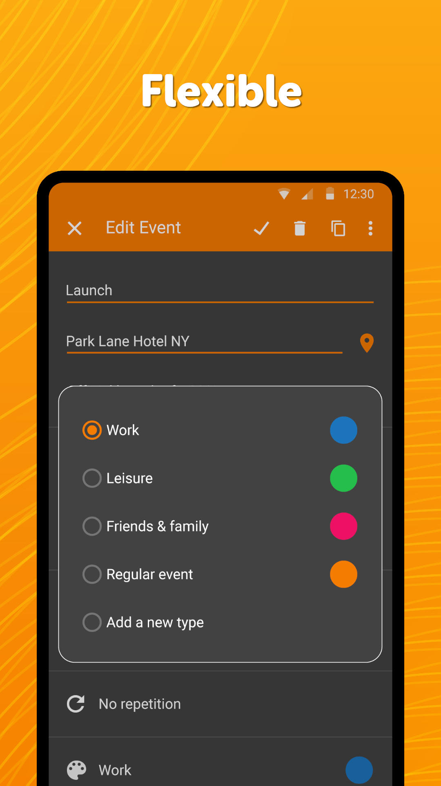

# Simple Calendar

Simple Calendar Pro is a fully customizable, offline calendar designed to do exactly what a calendar should do. No complicated features, unnecessary permissions and no ads!

Whether you’re organizing single or recurring events, birthdays, anniversaries, business meetings, appointments or anything else, Simple Calendar Pro makes it easy to stay organized. With an incredible variety of customization options you can customize event reminders, notification sounds, calendar widgets and how the app looks.

Daily, weekly and monthly views make checking your upcoming events &amp; appointments a breeze. You can even view everything as a simple list of events rather than in calendar view, so you know exactly what’s coming up in your life and when. 

----------------------------------------------------------
Simple Calendar Pro – Features &amp; Benefits
----------------------------------------------------------

✔️ No ads or annoying popups  
✔️ No internet access needed, giving you more privacy &amp; security  
✔️ Only the bare minimum permissions required  
✔️ Emphasis on simplicity – does what a calendar needs to do!  
✔️ Open source  
✔️ Fully customizable themes &amp; calendar / event widgets  
✔️ Translated into 29 languages  
✔️ Export settings to .txt files to import to another device  
✔️ CalDAV calendar sync supported to sync events across devices  
✔️ Daily, weekly, monthly, yearly &amp; event views on the calendar  
✔️ Supports exporting &amp; importing events via .ics files  
✔️ Set multiple event reminders, customize event reminder sound and vibration  
✔️ Snooze option for reminders  
✔️ Easily add holidays, birthdays, anniversaries &amp; appointments  
✔️ Customize events – start time, duration, reminders etc  
✔️ Add event attendees to each event  
✔️ Use as a personal calendar or a business calendar  
✔️ Choose between reminders &amp; email notifications to alert you about an event  

DOWNLOAD SIMPLE CALENDAR PRO – THE SIMPLE OFFLINE CALENDAR WITH NO ADS!

Check out the full suite of Simple Tools here:  
https://www.simplemobiletools.com

Standalone website of Simple Calendar Pro:  
https://www.simplemobiletools.com/calendar

Facebook:  
https://www.facebook.com/simplemobiletools

Reddit:  
https://www.reddit.com/r/SimpleMobileTools

