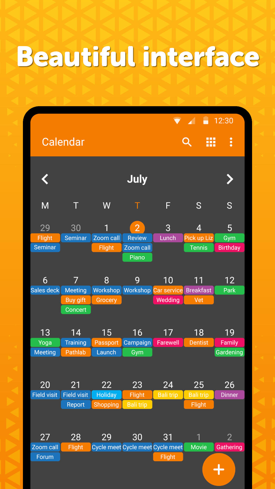
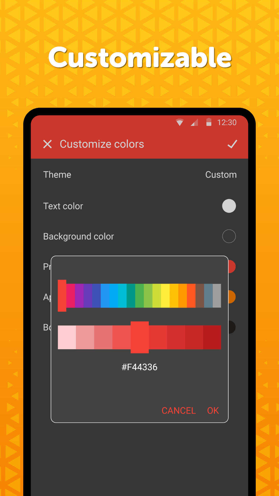
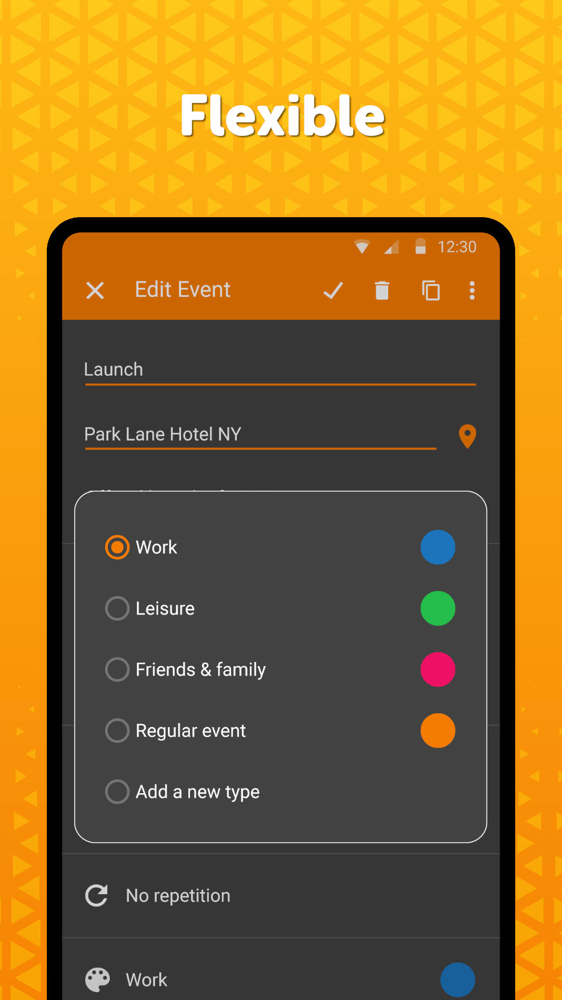

# Simple Calendar

Simple Calendar 2023 is a highly customizable, offline monthly calendar app for Android. Have an agenda planner in your pocket, designed to do exactly what a personal tiny schedule planner should do in 2023. No complicated features, unnecessary permissions, or ads!  
***Supports syncing events via Google Calendar

Download now!

Daily Digital Schedule App: Take Control of Your Time
Whether you are looking for a work calendar for business, a day planner, an appointment scheduler, or organization and scheduling of single and recurring events like birthdays, anniversary, appointment reminder, or anything else, Simple Calendar 2023 makes it easy to stay organized. The calendar widget has an incredible variety of customization options: customize event reminders, notification appearance, tiny calendar reminders widget, and overall appearance.

Schedule Planner: Plan Your Day
Appointment scheduler, monthly planner, and family organizer in one! Check your upcoming agenda, schedule business meetings, and events & book appointments easily. Reminders will keep you on time and informed on your daily schedule app. This 2023 calendar widget is remarkably easy to use. You can even view everything as a simple list of events rather than in a monthly view, so you know exactly what’s coming up in your life and how to organize and plan your agenda. 

Simple Calendar 2023 Features

✔️ The Best User Experience  
➕ No ads or annoying popups, truly great user experience!  
➕ No internet access is needed, giving you more privacy, security, and stability

✔️ Flexibility for Your Productivity  
➕ Calendar Widget supports exporting & importing events via .ics files  
➕ Export settings to .txt files to import to another device  
➕ Flexible event creation – times, duration, reminders, powerful repetition rules  
➕ CalDAV support for syncing events via Google Calendar, Microsoft Outlook, Nextcloud, Exchange, etc

✔️ Personalized Just for You  
➕ Schedule planner - customize and change sound, looping, audio stream, vibrations  
➕ Calendar widget - Colorful Calendars and customizable themes  
➕ Open source tiny calendar, translated into 30+ languages  
➕ Plan your day with others - ability to share events fast on social media, emails, etc  
➕ Family Organizer - with hasslefree event duplication, organization, and time management

✔️ Organization and Time Management  
➕ Day planner - the agenda planner will help you to organize your day  
➕ Weekly planner - staying ahead of your busy weekly schedule has never been easier  
➕ Itinerary manager - business calendar shared between teams at work  
➕ Appointment scheduler - organize and maintain your agenda with ease  
➕ Planning app - easy to use personal event, appointment reminder, and schedule planner  
➕ Plan your day - manage your day with this android schedule planner, event & family organizer

✔️ #1 Calendar App  
➕ Import holidays, contact birthdays, and anniversaries easily  
➕ Filter personal events quickly by event type  
➕ Daily schedule and event location, shown on a map  
➕ Quick business calendar, or personal digital agenda  
➕ Quickly switch between daily, weekly, monthly, yearly & event views

DOWNLOAD SIMPLE CALENDAR PLANNER – OFFLINE SCHEDULE AND AGENDA PLANNER WITH NO ADS! PLAN YOUR 2023 TIMETABLE!

Check out the full suite of Simple Tools here:  
https://www.simplemobiletools.com

Facebook:  
https://www.facebook.com/simplemobiletools

Reddit:  
https://www.reddit.com/r/SimpleMobileTools

Telegram:  
https://t.me/SimpleMobileTools

