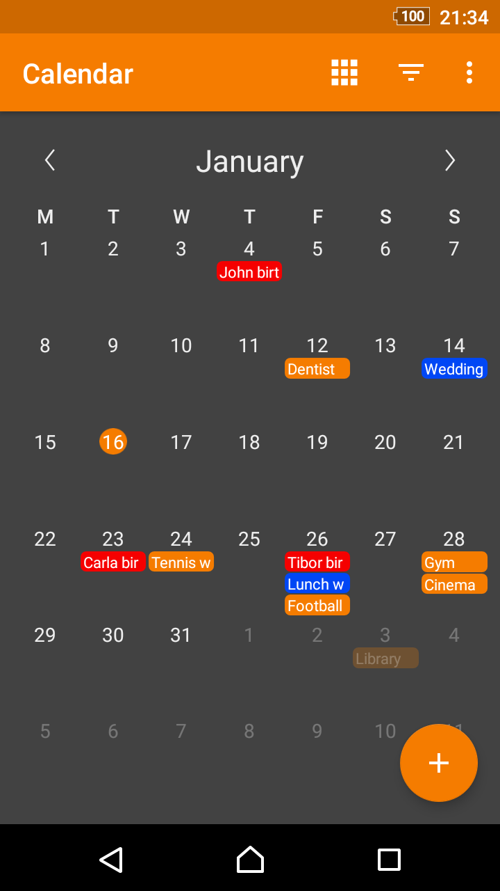
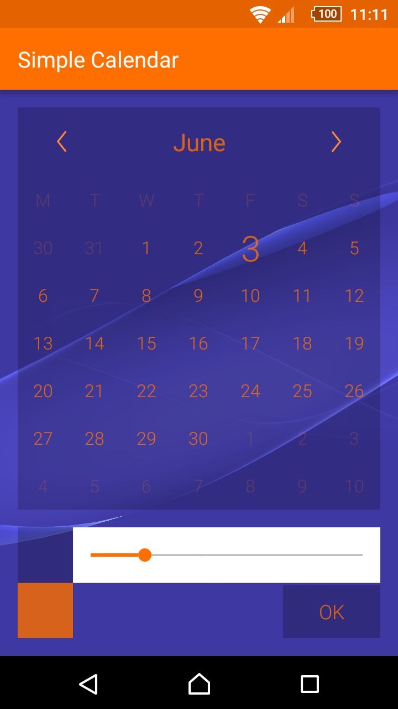
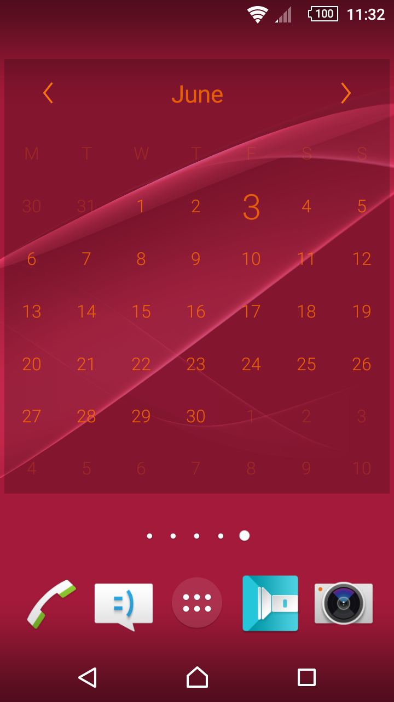

# Simple Calendar

A monthly calendar with the current day highlighted, without any other calendar integration, with Monday as the first day. You can easily check other months or years by pressing the month label in the app.

Contains a 4x4 widget where you can customize the color of the text, as well as the alpha and the color of the background. To open the app from the widget press the month label.

License
-------
    Copyright 2016 SimpleMobileTools
    
    Licensed under the Apache License, Version 2.0 (the "License");
    you may not use this file except in compliance with the License.
    You may obtain a copy of the License at
    
       http://www.apache.org/licenses/LICENSE-2.0
    
    Unless required by applicable law or agreed to in writing, software
    distributed under the License is distributed on an "AS IS" BASIS,
    WITHOUT WARRANTIES OR CONDITIONS OF ANY KIND, either express or implied.
    See the License for the specific language governing permissions and
    limitations under the License.
